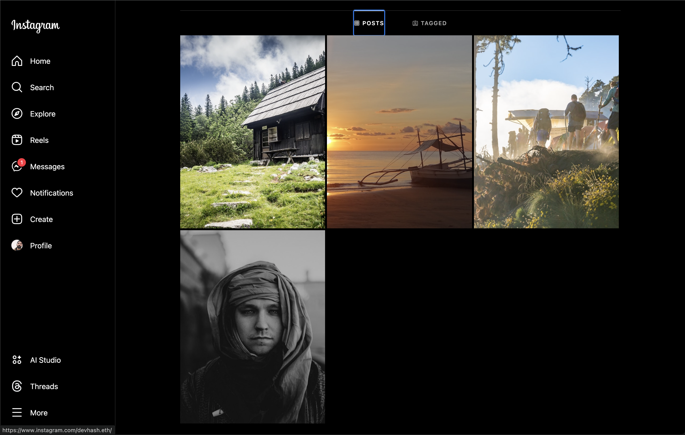
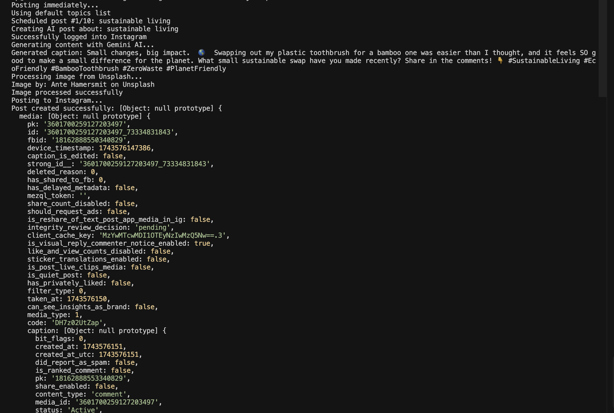

# Instagram AI Posting Agent

This is a Node.js application that automatically generates and posts content to Instagram using AI. It uses free tools including Google's Gemini AI and Unsplash for images.

## Preview

Here are some examples of posts created with this tool:




## Features

- AI-generated captions and hashtags using Gemini AI
- Automatic image sourcing from Unsplash
- Image processing to Instagram's recommended dimensions
- Scheduling functionality for automated posting
- Topic rotation from customizable list

## Prerequisites

- Node.js v14+ installed
- Instagram account
- Gemini AI API key
- Unsplash API key

## Setup

1. Clone or download this repository
2. Install dependencies:

```bash
npm install
```

3. Create a `.env` file in the root directory with:

```
INSTAGRAM_USERNAME=your_instagram_username
INSTAGRAM_PASSWORD=your_instagram_password
GEMINI_API_KEY=your_gemini_api_key
UNSPLASH_ACCESS_KEY=your_unsplash_access_key
UNSPLASH_SECRET_KEY=your_unsplash_secret_key
UNSPLASH_APP_ID=your_unsplash_app_id
```

## Usage

### Single Post

To create a single post about a specific topic:

```bash
node index.js "your topic here"
```

For example:

```bash
node index.js "sustainable living"
```

### Scheduled Posting

To start the scheduler:

```bash
node scheduler.js
```

This will set up a posting schedule (default: every 24 hours).

To immediately create a post and start the schedule:

```bash
node scheduler.js --post-now
```

### Customizing Topics

The scheduler rotates through a list of topics. The default topics are included, but you can customize them by creating a `topics.json` file:

```json
{
  "topics": [
    "topic 1",
    "topic 2",
    "topic 3",
    "..."
  ]
}
```

## Important Notes

- **Instagram API Usage**: This project uses the unofficial Instagram Private API. This may violate Instagram's terms of service. Use responsibly and at your own risk.
- **Rate Limiting**: To avoid account flagging, this tool is set to post once per day by default. Adjust with caution.
- **API Keys**: Both Gemini AI and Unsplash have free tiers with usage limits.

## Alternatives

If you don't want to use Gemini or Unsplash, you can modify the code to use:

- Text Generation: OpenAI API, Hugging Face's free API, local models like GPT-J
- Image Sources: Free stock photo sites, locally stored images, or DALL-E Mini (Craiyon)

## License

MIT 